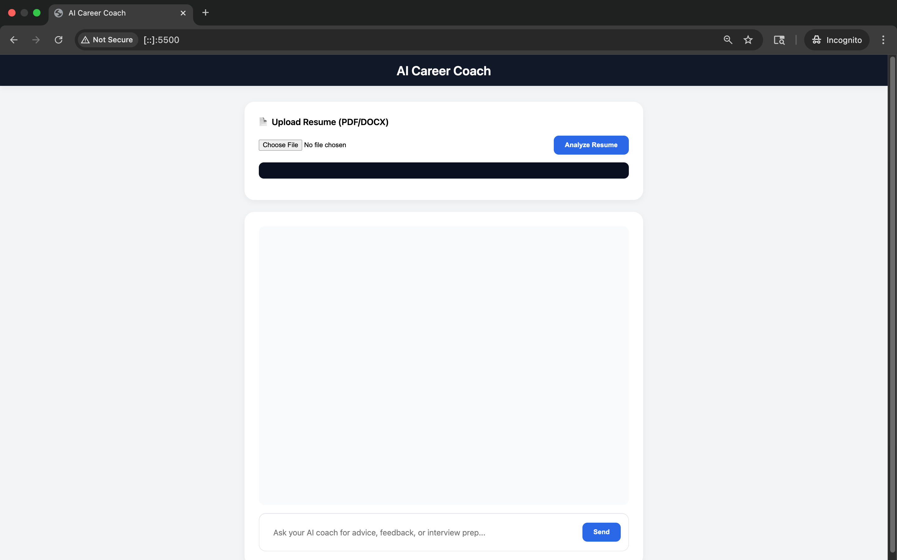
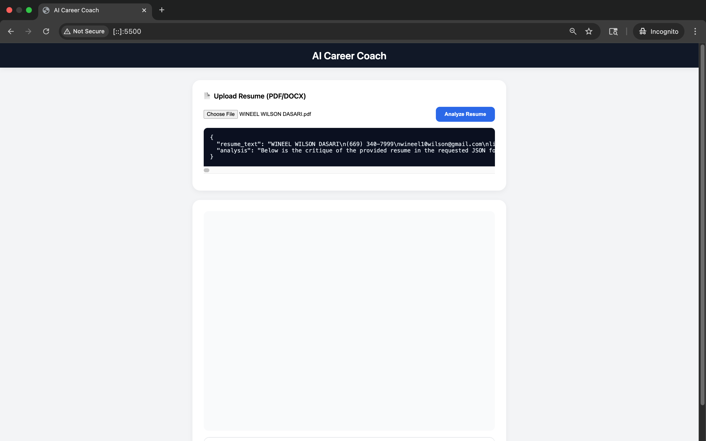
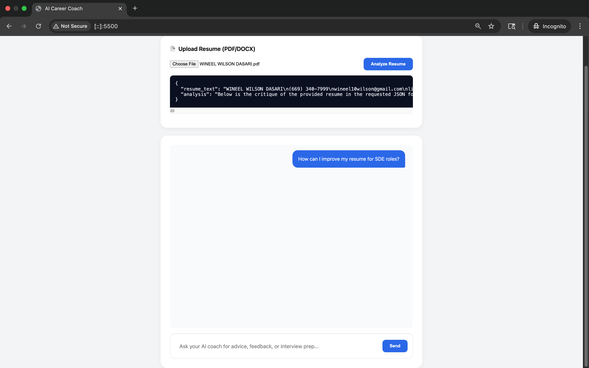
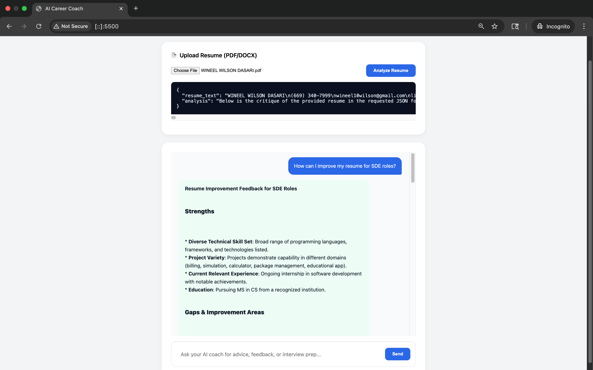

# AI Career Coach

An agentic AI career assistant powered by **NVIDIA Nemotron (NIM)**. It analyzes resumes, identifies skill gaps, retrieves live job openings, and returns actionable suggestions in real time. Built during the NVIDIA Developer Hackathon at Santa Clara University, with focus on reasoning workflow and NIM integration over UI simplicity.


## Table of Contents

- [Overview](#overview)
- [Core Workflow](#core-workflow)
- [Features](#features)
- [Tech Stack](#tech-stack)
- [Project Structure](#project-structure)
- [Getting Started](#getting-started)
  - [Run both servers (one command)](#run-both-servers-one-command)
  - [Manual run - two terminals](#manual-run--two-terminals)
  - [Environment variables](#environment-variables)
  - [Serve frontend from FastAPI (single process)](#serve-frontend-from-fastapi-single-process)
- [Demo](#demo)
- [Roadmap](#roadmap)
- [Acknowledgments](#acknowledgments)
- [Links](#links)


## Overview
**AI Career Coach** turns a static resume into an actionable career plan. It uses an agentic pipeline backed by **NVIDIA Nemotron via NIM** and uses **MCP** to fetch live job data.


## Core Workflow

| Step | Description |
| :-- | :-- |
| Resume Upload | Provide a PDF or DOCX resume |
| Nemotron Analysis | NIM performs structured parsing and contextual reasoning |
| Agentic Insights | Strengths, gaps, job matches, and better phrasing suggestions |
| Personalized Output | Clear edits and job recommendations you can act on |


## Features

| Feature | Description |
| ------- | ----------- |
| Resume Understanding | Extracts structured content from PDF or DOCX |
| Nemotron Agent | Context‑aware analysis of strengths and gaps |
| Agentic Workflow | Combines parsing, retrieval, and generation in one flow |
| Conversational UI | Minimal HTML + JS chat interface |
| Real‑Time Jobs | Uses MCP to fetch jobs from public APIs like Remotive |


## Tech Stack

| Layer | Technology |
| ----- | ---------- |
| LLM | NVIDIA Nemotron via NIM endpoint `/v1/chat/completions` |
| Backend | FastAPI on Python 3.10+ |
| Frontend | HTML, CSS, vanilla JavaScript |
| External API | Remotive Jobs API via MCP |


## Project Structure

```text
AI Career Coach/
├── LICENSE                       # MIT license
├── README.md                     # Project docs (this file)
├── dev.py                        # Cross‑platform one‑command runner
├── backend/
│   ├── app/
│   │   ├── main.py               # FastAPI entry point
│   │   ├── services/
│   │   │   ├── nim_client.py     # NVIDIA NIM client
│   │   │   ├── mcp_client.py     # MCP connector
│   │   │   └── resume_parser.py  # Resume extraction and structuring
│   │   └── prompts/
│   │       └── system.txt        # Base prompt for agent reasoning
│   └── requirements.txt          # Python dependencies
├── frontend/
│   └── index.html                # Minimal chat UI
├── mcp-servers/
│   └── jobs_server.py            # Job retrieval using Remotive API
├── imagesReadMe/                 # Images used in README
│   ├── image1.png                # Primary image
│   ├── image2.png
│   ├── image3.png
│   └── image4.png                
└── tmp/                          # Uploaded resumes (git-ignored)
```

> **Note:** `tmp/` stores local uploads. Keep it ignored; use `tmp/.gitkeep` if you want the folder tracked without content.


## Getting Started

### Run both servers (one command)
Use the cross‑platform Python runner.

```bash
# macOS/Linux
python3 dev.py

# Windows
py -3 dev.py
```

This will:
- Create/update `backend/.venv`
- Install dependencies
- Start FastAPI at **http://localhost:8000**
- Serve the frontend at **http://localhost:5500**
- Stop both with **`Ctrl+C`**


### Manual run - two terminals
**Terminal A (backend):**
```bash
cd backend
python3 -m venv .venv
source .venv/bin/activate      # macOS/Linux
pip install -r requirements.txt
uvicorn app.main:app --reload --port 8000
```

**Terminal B (frontend):**
```bash
cd frontend
python3 -m http.server 5500
```
Open http://localhost:5500 in your browser. Use **Ctrl+C** to stop each.


### Environment variables
Create `backend/.env` (never commit) or copy from `backend/.env.example`.

```env
NVIDIA_API_BASE=https://integrate.api.nvidia.com/v1
NVIDIA_API_KEY="NVIDIA API KEY"
NVIDIA_MODEL=nvidia/llama-3.3-nemotron-super-49b-v1
ALLOW_ORIGINS=*
```

**Keep secrets out of Git**
- `.env` is ignored. If it ever slipped into history, remove and recommit:
  ```bash
  git rm --cached backend/.env 2>/dev/null || true
  git commit -m "Remove backend/.env from repo"
  ```
- Provide a template for collaborators:
  ```bash
  cp backend/.env backend/.env.example  # then replace values with placeholders
  ```
- If a key leaked, **rotate** it in the NVIDIA portal and update `.env`.


### Serve frontend from FastAPI (single process)
If you prefer a single server, serve `frontend/` from FastAPI:

```python
# backend/app/main.py
from fastapi import FastAPI
from fastapi.staticfiles import StaticFiles
from fastapi.responses import FileResponse
from pathlib import Path

app = FastAPI()

FRONTEND_DIR = Path(__file__).resolve().parents[2] / "frontend"
app.mount("/assets", StaticFiles(directory=FRONTEND_DIR, html=False), name="assets")

@app.get("/")
def index():
    return FileResponse(FRONTEND_DIR / "index.html")
```
Run:
```bash
backend/.venv/bin/python -m uvicorn --app-dir backend app.main:app --reload --port 8000
```


## Demo

A quick, visual story of the app in action.

  1) **Launch** - Open the web app. The chat panel and resume upload card are ready.
    

  2) **Upload** - Select a PDF/DOCX. The filename appears and you can click *Analyze Resume*.
    

  3) **Parse** - The backend extracts resume text and Nemotron begins structured analysis.
    

  4) **Chat** - Ask questions like “How can I improve my resume for SDE roles?” The agent returns strengths, gaps, and edits.
    


## Roadmap

- Streaming responses from NIM for lower latency perception
- Better scoring and reasoning for job matches
- Session history and auth
- More MCP sources beyond Remotive
- Docker compose for one‑command startup


## Acknowledgments

- NVIDIA Developer team for Nemotron and NIM access
- SCU AI Club for hosting
- Team members who built this during the hackathon

## License

This project is open-source under the MIT License. 

See **[LICENSE](LICENSE)**. Feel free to adapt and extend!


## Authors / Credits

**Team of three**
|    |    |    |
|:--:|:--:|:--:|
| **Gareshma Nagalapatti** | [GitHub](https://github.com/Gareshma) | [LinkedIn](https://www.linkedin.com/in/gareshma/) |
| **Wineel Wilson Dasari** | [GitHub](https://github.com/wineel/) | [LinkedIn](https://www.linkedin.com/in/wineel/) |
| **Shanmukha Ganesna** | [GitHub](https://github.com/Shack77) | [LinkedIn](https://www.linkedin.com/in/shanmukha007/) |


## Links

[**LinkedIn announcement**](https://www.linkedin.com/posts/wineel_nvidia-agentsforimpact-hackathon-activity-7383728298410958849-BaGC)
